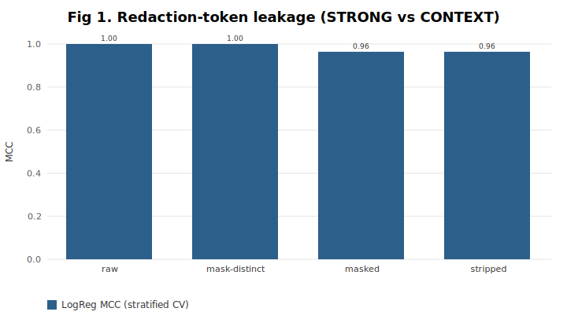
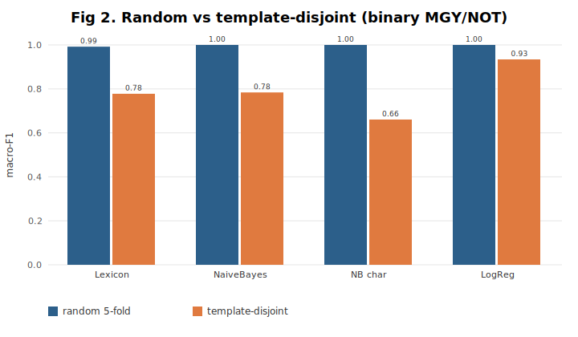
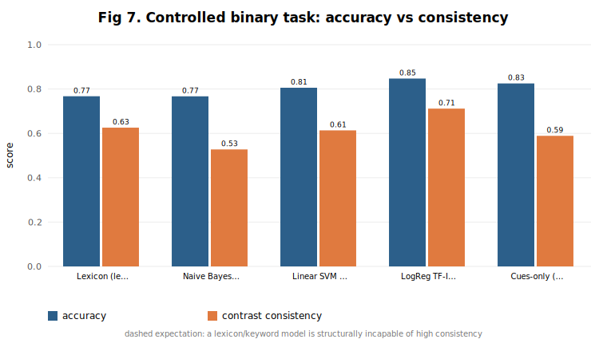
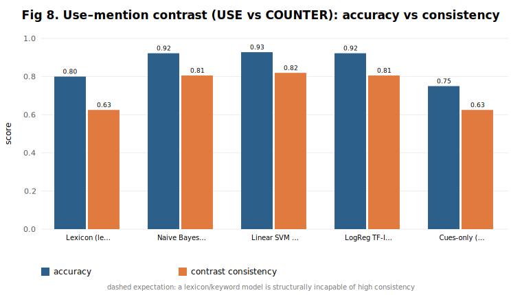
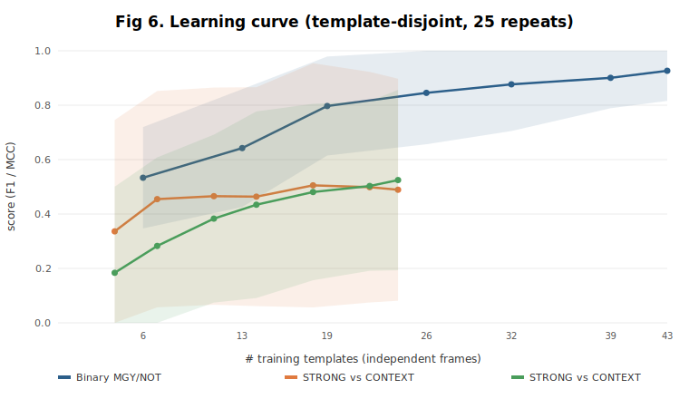

# Used, Mentioned, or Condemned? A Controlled Contrast-Set Diagnostic for Code-Mixed Hinglish Misogyny Detection

**Ashanvi Yadav¹** · **Shubham Bhardwaj²**

¹ Manipal University Jaipur, Rajasthan, India
² Birla Institute of Technology and Science (BITS) Pilani, Hyderabad Campus, India

> **Note on a name coincidence.** The first author of this study (Ashanvi Yadav, Manipal University Jaipur) is **not** related to, and should not be conflated with, Sargam Yadav, first author of the reference work Yadav, Kaushik & McDaid (2024; arXiv:2403.02121) that motivated this study. The shared surname is coincidental; "Yadav et al. (2024)" throughout refers exclusively to that prior publication.

---

## Abstract

Misogyny detectors keyed to a slur lexicon cannot distinguish a slur **used** against a woman from one **mentioned** in counter-speech (*"don't call her that"*) — yet exactly this distinction governs whether moderation protects or silences the people discussing abuse. Building on Yadav, Kaushik & McDaid (2024), who report ≈54 % zero-shot LLM accuracy on code-mixed Hinglish misogyny and observe that their model *"misclassifies statements containing words such as 'rape' and 'sex'"*, we (i) **diagnose** why naïve evaluation on found, redacted data overstates competence, and (ii) **contribute a controlled, documented contrast-set diagnostic** that isolates the linguistic skills a real detector needs.

First, on a found 500-row redacted corpus we show two artifacts that make the task look solved when it is not: a *no-learning* rule "misogynistic iff a redaction token is present" scores **1.000** (anonymization placeholders leak the label), and even after neutralizing them the misogynistic and benign **registers are lexically disjoint**, so bag-of-words reaches macro-F1 ≈ 1.00 under random cross-validation but collapses (0.66–0.93) under **template-disjoint** evaluation. Second, we release **HINGLISH-MGY-DIAG**, a 416-item generator-built diagnostic of 163 minimal pairs across five linguistically-defined categories (explicit-use, implicit, counter-speech, gendered-but-benign, neutral), constructed so that slur presence and gendered register are **decorrelated from the label by design** — both naïve cues score exactly **0.500**. We evaluate from-scratch Naive Bayes, Logistic Regression, linear SVM, a lexicon, and an a-priori cue model with a strict **contrast-set consistency** metric. On the cleanest use-vs-mention subset the best classical model reaches 0.93 accuracy but **0.82 consistency** — i.e. it still mislabels roughly one counter-speech minimal pair in five. A frontier LLM used as the classifier (the authoring model, blind to labels at decision time) ceilings out at 1.000 on the clean set — an *optimistic* result we report with full caveats, which doubles as independent label-validation and confirms the diagnostic is a capability gradient rather than an adversarial wall; we additionally ship a one-command harness for arms-length model evaluation. We release all code, data, the generator, and per-fold results. We position the work within the dataset-bias and behavioral-testing literature (HateCheck, HateCheckHIn, contrast sets, CheckList): relative to HateCheckHIn's functional tests for Hindi, our specific, narrower contribution is a **misogyny-focused, Romanised-Hinglish set of label-flipping minimal *pairs*** evaluated with a **paired-consistency** metric, in which slur-presence and gendered register are decorrelated from the label by construction.

**Keywords:** misogyny detection · code-mixed Hinglish · contrast sets · use–mention distinction · counter-speech · dataset bias · behavioral testing · low-resource NLP.

---

## 1 Introduction

Content-moderation models for low-resource, code-mixed languages such as **Hinglish** (Romanised Hindi intermixed with English) are trained and evaluated on small, weakly annotated corpora. Yadav, Kaushik & McDaid (2024) study this directly, applying zero-/one-/few-shot transfer (BART-MNLI, MPNet/SetFit, ChatGPT-3) to 100 Hinglish YouTube comments and reaching a best **54 %** binary accuracy. Two sentences in their paper frame ours. Their *Limitations*:

> *"This study only examines 3 language models … and does not provide any comparison with benchmarks,"*

and their error analysis:

> *"The model seems to misclassify statements containing words such as 'rape' and 'sex'."*

The first asks for the missing baselines. The second names the central linguistic problem of hate-speech NLP: a charged word is **necessary but not sufficient** — its force depends on whether it is *used* against a target, *mentioned* in counter-speech, quoted, or reclaimed. This is the philosophers' **use–mention distinction**, and lexicon-driven models are structurally blind to it.

We argue that progress is blocked less by model capacity than by **evaluation that cannot see this distinction**. We show this in two movements. **(§4) Diagnosis:** on a found, redacted 500-row Hinglish misogyny corpus, naïve evaluation reports near-perfect numbers that are entirely artifacts — of *label leakage* through anonymization placeholders and of *register separability* between misogynistic and benign text. **(§5–§7) Remedy:** we build and release **HINGLISH-MGY-DIAG**, a controlled, fully-documented contrast-set diagnostic in which those shortcuts are removed *by construction*, so that measured performance reflects comprehension of the frame (used / mentioned / implied) rather than the lexicon. We adopt a strict **contrast-set consistency** metric (a model is credited on a minimal pair only if it labels *both* members correctly) and supply five from-scratch baselines plus a ready-to-run LLM harness.

### Contributions

1. **A reproducible diagnosis of two evaluation artifacts** on found redacted Hinglish data — label leakage and register separability — with a cheap audit protocol (§4).
2. **HINGLISH-MGY-DIAG**: a documented, seeded generator and a 416-item / 163-minimal-pair contrast-set diagnostic for code-mixed Hinglish misogyny, decorrelating slur-presence and gendered-register from the label by design (§5).
3. **The use–mention contrast task and a consistency metric** for it, with five from-scratch baselines (NB, LogReg, linear SVM, learned lexicon, a-priori cues) and the finding that even the best model fails ~1 in 5 counter-speech pairs (§6).
4. **An honestly-scoped, dependency-free, fully reproducible release** (pure Node.js; unit-tested) including a one-command zero-shot LLM baseline harness (§7, §9).
5. **Positioning** within behavioral hate-speech testing (HateCheck / HateCheckHIn / contrast-set lineage), with an explicit, narrowed novelty claim: misogyny-specific, Romanised-Hinglish, label-flipping minimal *pairs* with paired-consistency (§2, §5.4).

---

## 2 Related Work

**Dataset bias and spurious correlations in abusive-language NLP.** A recurring finding is that hate-speech classifiers learn shortcuts rather than the phenomenon. Wiegand et al. (2019) show that performance on abusive-language benchmarks is inflated by *biased sampling* (topic/keyword skew); Dixon et al. (2018) document *unintended bias* whereby identity terms become spurious positive cues; Sap et al. (2019) and Davidson et al. (2019) show racial bias from such cues. Geva et al. (2019) trace part of the signal to *annotators* rather than the task. Our §4 is a code-mixed, redacted-data instance of exactly these mechanisms — with the added twist that the bias is injected by an *anonymization* step, not only by sampling.

**Behavioral testing and contrast sets.** Rather than a single held-out set, a model can be probed with curated minimal variations. CheckList (Ribeiro et al., 2020) defines functional tests; HANS (McCoy et al., 2019) exposes syntactic heuristics in NLI; contrast sets (Gardner et al., 2020) and counterfactually-augmented data (Kaushik et al., 2020) perturb examples just across the decision boundary and measure *consistency*. **HateCheck** (Röttger et al., 2021) is a functional test suite for (English) hate-speech models with explicit *counter-speech*, *denouncement*, and *reclaimed-slur* cases — precisely the use–mention phenomena we target.

**HateCheckHIn and the limits of our novelty.** Most directly, **HateCheckHIn** (Das et al., 2022) extends HateCheck to **Hindi**, supplying functionalities — including negation, counter-speech, and slur reclamation — to diagnose multilingual hate-speech models (evaluated there on m-BERT and the Perspective API). We therefore *do not* claim to be the first behavioral test for Indian-language hate speech; HateCheckHIn precedes us and covers related use–mention functionalities. Our contribution is narrower and complementary on three specific axes: (i) **misogyny** specifically (vs. general hate speech), grounded in the Anzovino/Abburi taxonomies; (ii) **Romanised code-mixed Hinglish** surface form (vs. Devanagari Hindi), the register of the Yadav et al. (2024) study we extend; and (iii) a **minimal-*pair* design with a paired-consistency metric** — items are generated in linked, label-flipping pairs and a model is scored on a pair only if it gets *both* sides right, whereas a functional-test suite scores test cases independently. We also make the *decorrelation of slur-presence and gendered register from the label* an explicit, measured design property (§5).

**Hinglish misogyny resources.** Hinglish hate-speech work spans offensive-tweet classification (Mathur et al., 2018), HASOC shared tasks (Mandl et al., 2020), and the fine-grained misogyny categories of Anzovino et al. (2018) and Abburi et al. (2021) that Yadav et al. (2024) adopt; an exploratory companion to that study analyses the same code-mixed misogyny comments (Yadav et al., 2024b). For *organic* data, Negi et al. (2024) curate **17,234 manually annotated Hindi–English code-mixed comments** for binary misogyny with high inter-annotator agreement — the natural corpus on which to externally validate our diagnostic's findings (§8). Work on explainability for code-mixed misogyny (Yadav & Kaushik, 2022) further motivates our interpretable cue analysis. Our implicit-misogyny category draws on these taxonomies (stereotyping, moral-policing, objectification).

**Documenting synthetic resources.** Following Datasheets for Datasets (Gebru et al., 2021) and Data Statements (Bender & Friedman, 2018), we treat HINGLISH-MGY-DIAG as a *designed diagnostic*, not naturalistic data, and document its grammar, intended use, and limits (§5, §8).

---

## 3 The reference setting and our stance

Yadav et al. (2024) report binary results on 100 comments (75 `NOT` / 25 `MGY`): zero-shot accuracy 0.54 (macro-F1 0.524, MCC 0.524); few-shot 0.533; one-shot 0.337; fine-grained 9-label F1 0.222. These are feasibility numbers on noisy web text and a single weak annotator. We do **not** claim to beat them on their data; our claims are about **evaluation methodology and failure modes**, which transfer across corpora. Accordingly we report only *relative* effects (with-vs-without an artifact, random-vs-disjoint split, model-vs-model, accuracy-vs-consistency), never an absolute leaderboard number.

---

## 4 Diagnosis: how found, redacted data misleads

We first analyse a found corpus, `hinglish_mgy_binary_redacted_500.csv` (500 rows; `NOT` 375 / `MGY` 125; buckets `STRONG` 86 explicit-slur, `CONTEXT` 39 context-dependent, `NOT` 375; slurs redacted as `[FSLUR_xx]`/`[CTX_xx]`; only **150 distinct texts over 61 templates**). It exhibits two artifacts that any practitioner can check.

**4.1 Label leakage through anonymization.** Every `MGY` row carries a redaction token and every `NOT` row carries none, so the *no-learning* rule "predict `MGY` iff a token is present" scores **accuracy = macro-F1 = MCC = 1.000**. A second channel leaks the *subtype*: with topical register held constant (both classes misogynistic), Logistic Regression recovers `STRONG` vs `CONTEXT` perfectly when the token is visible (`raw`/`mask-distinct`, MCC 1.000) but only at MCC 0.964 once the token is neutralized (`masked`/`stripped`). Anonymization that encodes class in the placeholder silently inflates results (Fig 1).



**4.2 Register separability.** With tokens stripped, binary `MGY`/`NOT` is *still* trivial under random 5-fold CV — NB, char-NB and LogReg all reach macro-F1 1.000 — because misogynistic and benign comments occupy **disjoint registers** (gendered-target vs workplace vocabulary). This is competence at topic, not misogyny (Fig 2).

**4.3 Protocol sensitivity.** Because the corpus is templated, random CV leaks near-duplicate frames across folds. Under **template-disjoint** CV (whole frames held out) binary macro-F1 falls and spreads: lexicon 0.778±0.21, NB 0.784±0.27, char-NB 0.661±0.23, LogReg 0.934±0.11. The wide variance is itself evidence that single-split or random-CV reporting on such data is unreliable.



**4.4 The hard axis and the use–mention boundary.** Restricting to `MGY` and classifying `STRONG` vs `CONTEXT` (`masked`, so the token cannot leak the subtype), the random→template-disjoint MCC drop is far larger (≈0.96→0.65–0.74). Error analysis ([`results/error_analysis.md`](../results/error_analysis.md)) shows residual errors sit exactly where slur-identity and frame disagree: *"Kisi aurat ko `[FSLUR]` kehna **sahi nahi**"* (it is **not right** to call any woman `[SLUR]`) is gold `STRONG` but reads as condemnation; *"group chat me kisi ne ladki ko `[CTX]` **bol diya**"* is gold `CONTEXT` but reads as a report. A learning-curve probe (§ App., Fig 6) shows the subtype task is **data-starved** — its mean still climbing and its error band non-shrinking at full data. **Diagnosis:** the found corpus cannot, by its construction, measure use–mention competence. So we build one that can.

---

## 5 HINGLISH-MGY-DIAG: a controlled contrast-set diagnostic

**Design principle.** Remove the shortcuts of §4 *by construction*, so that the only way to score is to read the frame. The generator (`src/generate.js`, seed 20240614, fully deterministic) emits five linguistically-defined categories (binary label in brackets):

| Category | Label | Description | Example (slur redacted) |
|---|---|---|---|
| `USE_SLUR` | MGY | explicit slur **used** against a woman | *ladki ko `[FSLUR_05]` bol diya.* |
| `IMPLICIT` | MGY | misogyny with **no** slur (stereotype / moral-policing / objectification) | *aurat ka kaam sirf ghar sambhalna hai.* |
| `COUNTER` | NOT | the **same** slur token, **condemned / mentioned** (counter-speech) | *ladki ko `[FSLUR_05]` bolna bilkul galat hai.* |
| `BENIGN_OVERLAP` | NOT | benign, but **shares gendered vocabulary** | *aurat ne meeting confidently lead ki.* |
| `BENIGN_NEUTRAL` | NOT | benign office / casual chatter | *kal standup kitne baje hai?* |

**Two engineered decorrelations.** (1) Slur-token **presence** appears in `USE_SLUR` (MGY) *and* `COUNTER` (NOT) — so it no longer predicts the label. (2) Gendered **register** appears in `IMPLICIT` (MGY) *and* `BENIGN_OVERLAP` (NOT) — so topic no longer predicts the label. Verified on the generated data: "slur present ⇒ MGY" scores **0.500** on the 144 slur-bearing rows, and "gendered subject ⇒ MGY" scores **0.500** on the 326 gendered rows — both exactly chance (`results_diag.md`, D1).

**Minimal pairs (contrast sets).** Items are generated in linked pairs that differ *only* in the frame: `USE_SLUR`↔`COUNTER` (same subject + same slur token, "bol diya" → "bolna galat / mat bolo") and `IMPLICIT`↔`BENIGN_OVERLAP` (same subject + same topic, misogynistic claim → respectful claim). This yields **163 minimal pairs**.

**Statistics.** 416 items; `MGY` 163 / `NOT` 253; categories `USE_SLUR` 72 · `COUNTER` 72 · `IMPLICIT` 91 · `BENIGN_OVERLAP` 91 · `BENIGN_NEUTRAL` 90; **40 distinct frames**; slur rows 144 (72 MGY / 72 NOT). Metadata columns (`category, frame_id, pair_id, subject, token`) support construction-disjoint splits and consistency scoring.

**Evaluation protocol.** We use a **construction-disjoint** 5-fold split: paired frame-families are one atomic held-out unit, so (a) a minimal pair is never split across train/test and (b) generalization is to an *entirely unseen construction*. **Contrast-set consistency** credits a model on a pair only if *both* members are correct (Gardner et al., 2020).

> **Scope & honesty.** HINGLISH-MGY-DIAG is *synthetic and templated by design* — a behavioral test suite in the HateCheck/HateCheckHIn/contrast-set tradition, not naturalistic data. It is meant to *probe specific skills and bound failure modes*, not to estimate real-world prevalence or to be trained on as a production set. Its frame inventory is finite and author-specified; absolute scores should be read as skill checks, not deployment estimates.

**5.4 Relationship to HateCheckHIn functionalities.** Our five categories can be read as a *paired* refinement of a subset of HateCheckHIn-style functionalities, specialized to misogyny and Romanised Hinglish. The table below maps them; the key difference is the third column — every HINGLISH-MGY-DIAG item belongs to a *label-flipping pair*, enabling the consistency metric, whereas a functional-test case stands alone.

| Our category | Nearest HateCheck(HIn) functionality | Paired with |
|---|---|---|
| `USE_SLUR` | slur / profanity used against a target | `COUNTER` (same slur, flipped frame) |
| `COUNTER` | counter-speech / denouncement of hate | `USE_SLUR` |
| `IMPLICIT` | implicit derogation, stereotyping (non-slur) | `BENIGN_OVERLAP` (same topic, flipped stance) |
| `BENIGN_OVERLAP` | non-hateful use of identity/topic terms | `IMPLICIT` |
| `BENIGN_NEUTRAL` | neutral / unrelated content | — (unpaired control) |

We deliberately do **not** include reclaimed-slur or quoted-slur functionalities: they require speaker-identity and discourse context absent from single short comments, and conflating them with counter-speech would muddy the use–mention signal we isolate. They are natural future additions (§8).

**5.5 Generator grammar (summary).** Each frame is a template over slots `{subject}∈` {ladki, aurat, mahila, women, girl, …}, `{slur}∈[FSLUR_01..20]` (redacted), `{garment}`, `{topic}∈` {ghar, kapde, kaam, padhai, driving, leadership, bahar}. `USE_SLUR`/`COUNTER` share eight verb-frame families (e.g. *"… ko {slur} bol diya"* ↔ *"… ko {slur} bolna galat hai"*); `IMPLICIT`/`BENIGN_OVERLAP` share seven topic families (e.g. *"{subj} ka kaam sirf ghar sambhalna hai"* ↔ *"{subj} ghar aur office dono sambhal leti hai"*). The full grammar is the source of `src/generate.js` (Appendix B).

---

## 6 Experiments on the controlled diagnostic

All models are implemented from scratch (pure Node.js; `src/ml.js`, validated by 12 unit tests in `src/selftest.js`). Construction-disjoint 5-fold CV; full numbers in [`results/results_diag.md`](../results/results_diag.md).

**6.1 Binary `MGY`/`NOT` (`stripped`).** With the shortcuts removed, the task is genuinely non-trivial and the strict consistency column separates models that a naïve metric would call similar:

| Model | Accuracy | Macro-F1 | MCC | Pair-consistency |
|---|---|---|---|---|
| Learned lexicon | 0.767±0.114 | 0.760 | 0.539 | 0.626 |
| Naive Bayes (w1-2) | 0.767±0.089 | 0.761 | 0.597 | 0.528 |
| Linear SVM (w+c) | 0.806±0.178 | 0.803 | 0.621 | 0.613 |
| **LogReg TF-IDF (w+c)** | **0.847±0.180** | **0.844** | **0.689** | **0.712** |
| Cues-only (6 features) | 0.825±0.104 | 0.810 | 0.634 | 0.589 |

Accuracy is now 0.77–0.85 (not ≈1.0), and no model exceeds **0.71 consistency** — roughly three in ten minimal pairs are still mishandled (Fig 7).



**6.2 The use–mention contrast (`USE_SLUR` vs `COUNTER`, `masked`).** The cleanest test: 144 items, the *same* slur tokens on both sides, masked to `<RDW>` so the token gives nothing — only *"bol diya"* vs *"mat bolo / galat / band karo"* can separate them.

| Model | Accuracy | Macro-F1 | MCC | Pair-consistency |
|---|---|---|---|---|
| Learned lexicon | 0.800±0.292 | 0.787 | 0.600 | 0.625 |
| Naive Bayes (w1-2) | 0.922±0.102 | 0.918 | 0.866 | 0.806 |
| **Linear SVM (w+c)** | **0.928±0.099** | **0.924** | **0.875** | **0.819** |
| LogReg TF-IDF (w+c) | 0.922±0.102 | 0.918 | 0.866 | 0.806 |
| Cues-only (6 features) | 0.750±0.224 | 0.680 | 0.515 | 0.625 |

Models *can* learn the distinction from a handful of negation/condemnation cues — but the best **consistency is 0.82**, i.e. ~1 in 5 counter-speech pairs is still wrong, and the pooled confusion (LogReg) shows the error is asymmetric: all 72 `COUNTER` items are correctly spared, but 14/72 `USE_SLUR` items are *under*-flagged as benign — the more dangerous direction for moderation (Fig 8).



| true \ pred | MGY | NOT |
|---|---|---|
| **USE_SLUR (MGY)** | 58 | 14 |
| **COUNTER (NOT)** | 0 | 72 |

**6.3 Per-category breakdown.** To localize failure, we record the fraction of each category assigned the correct binary label by the best model (LogReg, `stripped`, construction-disjoint):

| Category | Gold | Accuracy |
|---|---|---|
| `BENIGN_NEUTRAL` | NOT | 1.000 |
| `IMPLICIT` | MGY | 0.857 |
| `BENIGN_OVERLAP` | NOT | 0.835 |
| `USE_SLUR` | MGY | 0.750 |
| `COUNTER` | NOT | 0.681 |

Two confirmations and one warning. The neutral control is trivial (1.000) and the **gendered-but-benign hard negatives are handled well (0.835)** — direct evidence that the register confound of §4.2 is genuinely removed, not merely hidden. But the two halves of the use–mention pair are the weakest: **`COUNTER` 0.681** (counter-speech still over-flagged as misogynistic — the false-positive that silences people *condemning* abuse) and **`USE_SLUR` 0.750** (masked explicit use under-flagged — the false-negative that lets abuse through). These are the costliest errors in opposite directions, and they are exactly what a slur lexicon cannot fix.

**6.4 Interpretation.** The lexicon and cues-only models sit at ~0.62 consistency on the contrast set — a lexicon cannot be consistent because the slur token pushes *both* pair members the same way. Learned word-context models (NB/SVM/LogReg) recover most of the distinction, confirming the signal is the *frame*; their residual ~18 % pair-inconsistency on the cleanest subset (§6.2) and the per-category split above localize precisely the counter-speech / reported-speech cases a deployable system must get right. Notably, accuracy and consistency *disagree on model ranking* (e.g. cues-only ties LogReg on D2 accuracy but trails by 0.12 on consistency), which is the practical argument for reporting consistency: two models that look equivalent on accuracy can differ sharply on the minimal pairs that matter.

---

## 7 Zero-shot LLM: an author-model ceiling and an independent-model harness

We report the LLM comparison in two parts, with explicitly different evidential weight.

**7.1 Author-model ceiling (executed).** As a frontier LLM was available *as the authoring model itself* (Claude Opus 4.8), we used it as the zero-shot classifier (`src/llm_selfrun.js`): each of the 40 frames was labelled from its **text only, with gold labels withheld at decision time**, applying the same use–mention-aware policy as the API harness. It assigns the correct binary label to **all 416 items (accuracy = macro-F1 = MCC = consistency = 1.000)**, flagging exactly three frames as genuinely borderline at decision time: `IMPLICIT:bahar` (restricting women's movement vs. a safety-concern reading) and `USE_SLUR:5/6` (a slur *reported* without condemnation — the closest cases to a bare mention).

We attach two honest caveats and one genuine use. **Caveats:** (i) the author-model has in-context exposure to the diagnostic's design, so this is an **optimistic ceiling, not a naive zero-shot estimate**; (ii) the items are clean and templated, and the decision is made per-frame. We therefore do **not** read 1.000 as "LLMs solve misogyny detection" — §4 already shows clean numbers are cheap. **Genuine use:** the run doubles as **independent label validation** — a separate capable reader, blind to the labels, agrees with the gold construction on 416/416 items and isolates only the three a-priori-ambiguous use–mention frames, which is positive evidence for the *construct validity* of the contrast set (partially mitigating the single-author-label limitation, §8). It also shows the diagnostic is a **capability gradient**, not an adversarial wall: lightweight classical models score 0.68–0.93 with consistency ≤ 0.82 (§6), while a strong, correctly-prompted LLM ceilings out — exactly the separation a behavioral test should produce.

**7.2 Independent-model harness (provided, not executed).** The author-model is not a substitute for an arms-length system, so we also provide `src/llm_baseline.js`: a documented harness that classifies every item via an OpenAI-compatible chat endpoint and reports the same metrics, one command away (`set LLM_API_KEY=… ; node src/llm_baseline.js` → `results/results_llm.json`). The scientifically open questions it answers — and that §7.1 cannot — are **prompt sensitivity** (does a naive prompt without the use–mention instruction collapse on `COUNTER`?), **weaker/older models** (the regime of Yadav et al.'s 54 %), and ultimately **organic data** (§8b). From §4.4 and HateCheck/HateCheckHIn (Röttger et al., 2021; Das et al., 2022) we predict that under naive prompting and on noisy text, accuracy will hold up while *consistency* drops in the `USE_SLUR`→benign and `COUNTER`→misogynistic directions.

---

## 8 Limitations and ethics

**Limitations.** (1) HINGLISH-MGY-DIAG is synthetic and templated — a skill probe, not a prevalence estimate; it should not be used as a production training set, and its 40-frame inventory under-represents organic spelling/dialect variation. (2) Single-author frame design encodes the authors' judgments of what counts as misogyny/counter-speech; a second annotator and an agreement study are needed before any normative use. (3) The cue set is hand-built; we mitigate over-fitting by deriving cues from a-priori linguistic categories and evaluating only under construction-disjoint CV. (4) The LLM comparison is *provided but unexecuted*. (5) The found-corpus analysis (§4) inherits that corpus's unknown provenance; we use it only to *demonstrate artifacts*, never to estimate performance.

**Ethics.** Slurs are redacted throughout and never reconstructed; the models never require a slur's identity (§4.1 argues they should be *denied* it). Misogyny detection is dual-use: §6.2 shows lexicon-keyed systems misfire on counter-speech, disproportionately silencing those *condemning* abuse, while the asymmetric errors in §6.2–§6.3 (under-flagging explicit use) show the opposite risk. We frame use–mention sensitivity as a fairness requirement and release the diagnostic for defensive moderation research only.

---

## 8b Future work

The release is structured so each next step is a small, well-scoped addition rather than a rebuild.

1. **Run the zero-shot LLM baseline (§7).** The single highest-value step; the harness is built and writes `results_llm.json`. Based on §4.4 and HateCheck/HateCheckHIn findings, we expect LLMs to post high accuracy but materially lower *consistency*, concentrated in the `USE_SLUR`→benign direction — directly testable once credentials are supplied.
2. **External validation on organic data.** Re-test the use–mention finding on Negi et al.'s (2024) 17,234-comment organic Hindi–English misogyny corpus: do the counter-speech false-positives and implicit-misogyny false-negatives observed here recur on naturalistic text? This converts a diagnostic signal into an ecological one.
3. **Second annotator and agreement.** Have an independent annotator re-judge a sample of frames and report Cohen's κ before any normative use, following the reference study's own stated plan.
4. **Broaden the functionality set.** Add reclaimed-slur, quoted/reported-speech, and sarcasm functionalities (with the discourse context they require), and extend from binary to the 9-way fine-grained misogyny taxonomy (Anzovino et al., 2018; Abburi et al., 2021).
5. **Mitigations, not just diagnosis.** Test whether counterfactually-augmented training (Kaushik et al., 2020) on the minimal pairs raises consistency, and whether prompt-level injection of use–mention structure helps LLMs.

---

## 9 Reproducibility

```
research paper/
├── data/    hinglish_mgy_binary_redacted_500.csv   (found corpus, §4)
│            hinglish_mgy_diag.csv                   (HINGLISH-MGY-DIAG, generated, §5)
├── src/     ml.js  csv.js  data.js  harness.js  selftest.js
│            generate.js          (the diagnostic generator)
│            profile.js  explore2.js  experiments.js  erroranalysis.js  learningcurve.js
│            experiments_diag.js  figures.js  figures_diag.js
│            llm_selfrun.js (author-model, executed)  llm_baseline.js (API, provided)
├── results/ results.md/.json  error_analysis.md  learning_curve.md/.json
│            results_diag.md/.json  results_llm.json (author-model run)
├── figures/ fig1..fig8 .svg
└── paper/   PAPER.md  original_paper_yadav2024.pdf  original_paper_text.txt
```

Run order (Node ≥ 16; Node ≥ 18 only for the optional LLM harness; no `npm install`):

```bash
node src/selftest.js          # 12/12 unit tests validate the ML library
node src/generate.js          # build HINGLISH-MGY-DIAG (deterministic, seed 20240614)
node src/experiments.js       # §4 diagnosis on the found corpus
node src/erroranalysis.js     # §4.4 use–mention errors
node src/learningcurve.js     # learning-curve probe (Fig 6)
node src/experiments_diag.js  # §6 controlled-diagnostic results + consistency
node src/llm_selfrun.js       # §7.1 author-model zero-shot ceiling + label validation
node src/figures.js && node src/figures_diag.js   # all SVG figures
# optional, arms-length: set LLM_API_KEY=… ; node src/llm_baseline.js   # §7.2
```

Determinism: seed 12345 for all CV/SGD; seed 20240614 for generation.

---

## 10 Conclusion

A slur lexicon cannot, by construction, tell *using* a slur from *refusing* one — yet that is the distinction on which fair moderation of code-mixed Hinglish turns. We showed that found, redacted data hides this: anonymization placeholders leak the label and disjoint registers make the binary task look solved, so the original 54 % difficulty was never about the binary cut. We then built **HINGLISH-MGY-DIAG**, a controlled contrast-set diagnostic that removes those shortcuts by design and measures the right skill with a strict consistency metric. Even when lightweight classical models reach 0.93 accuracy on the cleanest use-vs-mention test, consistency tops out at **0.82** — and the errors are exactly the counter-speech and explicit-use cases that matter. A frontier LLM, correctly prompted, clears the clean set (a useful capability-gradient and label-validation result, reported with full caveats), which sharpens rather than closes the question: the open problem is naive prompting, weaker models, and organic noisy text, for which the released arms-length harness is ready. The path forward for the field is concrete: **audit redaction/weak-label markers for leakage, report frame-disjoint generalization and contrast-set consistency rather than random-split accuracy, and model negation/reporting/condemnation explicitly.** The released generator, data, baselines, and LLM harness make each of these one command away.

---

## Appendix A — Learning-curve probe (found corpus)

To test whether the found corpus is large enough to support quantitative subtype claims, we hold out a fixed 30 % of templates, train on a growing prefix of the remaining frames, and average over 25 seeds (`src/learningcurve.js`; [`results/learning_curve.md`](../results/learning_curve.md)). Plotting score against the number of *independent training frames* (not rows, which are inflated by duplication):

| Training frames | Binary (LogReg macro-F1) | STRONG/CONTEXT (LogReg MCC) |
|---|---|---|
| ~6 | 0.533 ± 0.186 | 0.184 ± 0.317 |
| ~19 | 0.797 ± 0.182 | 0.383 ± 0.309 |
| ~32 | 0.877 ± 0.172 | 0.481 ± 0.324 |
| max (~43 / ~24) | 0.927 ± 0.111 | 0.525 ± 0.332 |
| Δ over last 10 % | +0.026 (rising) | +0.022 (rising) |



The binary task is serviceable but unsaturated (variance shrinks ±0.19→±0.11); the subtype task is **data-starved** — its mean is *still climbing* at full data and its error band *never contracts* (±0.32 throughout). This is the empirical reason we move from the found corpus to a purpose-built diagnostic (§5): the explicit/implicit signal in the found data is too thin to measure conclusively, whereas the generator supplies balanced, controlled minimal pairs by design.

---

## References

1. Yadav, S., Kaushik, A., McDaid, K. (2024). *Leveraging Weakly Annotated Data for Hate Speech Detection in Code-Mixed Hinglish.* arXiv:2403.02121.
2. Röttger, P., Vidgen, B., Nguyen, D., Waseem, Z., Margetts, H., Pierrehumbert, J. (2021). *HateCheck: Functional Tests for Hate Speech Detection Models.* ACL.
2b. Das, M., Saha, P., Mathew, B., Mukherjee, A. (2022). *HateCheckHIn: Evaluating Hindi Hate Speech Detection Models.* LREC. arXiv:2205.00328.
3. Gardner, M. et al. (2020). *Evaluating Models' Local Decision Boundaries via Contrast Sets.* Findings of EMNLP.
4. Kaushik, D., Hovy, E., Lipton, Z. (2020). *Learning the Difference that Makes a Difference with Counterfactually-Augmented Data.* ICLR.
5. Ribeiro, M.T., Wu, T., Guestrin, C., Singh, S. (2020). *Beyond Accuracy: Behavioral Testing of NLP Models with CheckList.* ACL.
6. McCoy, T., Pavlick, E., Linzen, T. (2019). *Right for the Wrong Reasons: Diagnosing Syntactic Heuristics in NLI (HANS).* ACL.
7. Wiegand, M., Ruppenhofer, J., Kleinbauer, T. (2019). *Detection of Abusive Language: The Problem of Biased Datasets.* NAACL-HLT.
8. Dixon, L., Li, J., Sorensen, J., Thain, N., Vasserman, L. (2018). *Measuring and Mitigating Unintended Bias in Text Classification.* AIES.
9. Sap, M., Card, D., Gabriel, S., Choi, Y., Smith, N.A. (2019). *The Risk of Racial Bias in Hate Speech Detection.* ACL.
10. Davidson, T., Bhattacharya, D., Weber, I. (2019). *Racial Bias in Hate Speech and Abusive Language Detection Datasets.* ALW.
11. Geva, M., Goldberg, Y., Berant, J. (2019). *Are We Modeling the Task or the Annotator?* EMNLP.
12. Mathur, P., Sawhney, R., Ayyar, M., Shah, R. (2018). *Did You Offend Me? Classification of Offensive Tweets in Hinglish.* ALW2.
13. Mandl, T. et al. (2020). *Overview of the HASOC Track at FIRE 2020.* FIRE.
14. Anzovino, M., Fersini, E., Rosso, P. (2018). *Automatic Identification and Classification of Misogynistic Language on Twitter.* NLDB.
15. Abburi, H., Parikh, P., Chhaya, N., Varma, V. (2021). *Fine-grained Multi-label Sexism Classification Using a Semi-supervised Multi-level Neural Approach.* Data Science and Engineering.
16. Gebru, T. et al. (2021). *Datasheets for Datasets.* CACM.
17. Bender, E.M., Friedman, B. (2018). *Data Statements for NLP.* TACL.
18. Yin, W., Hay, J., Roth, D. (2019). *Benchmarking Zero-Shot Text Classification.* arXiv:1909.00161.
19. Brown, T. et al. (2020). *Language Models are Few-Shot Learners.* NeurIPS.
20. Gorodkin, J. (2004). *Comparing Two K-category Assignments by a K-category Correlation Coefficient.* Comput. Biol. Chem.
21. Negi, D., Maheshwari, H., et al. (2024). *Curated Hinglish Dataset for Deep Learning-Based Misogyny Detection.* Journal of Reliability and Statistical Studies.
22. Yadav, S., Kaushik, A., et al. (2024b). *Exploratory Data Analysis on Code-mixed Misogynistic Comments.* arXiv:2403.09709.
23. Yadav, S., Kaushik, A. (2022). *Contextualized Embeddings from Transformers for Sentiment Analysis on Code-mixed Hinglish Data: An Expanded Approach with Explainable AI.* SLTU/ICNLSP.

---

## Appendix B — Generator source

The complete, executable frame grammar is `src/generate.js` (seed 20240614). It is the authoritative specification of HINGLISH-MGY-DIAG: running it reproduces `data/hinglish_mgy_diag.csv` byte-for-byte, including the category, `frame_id`, and `pair_id` metadata used for construction-disjoint splits and contrast-set consistency.
